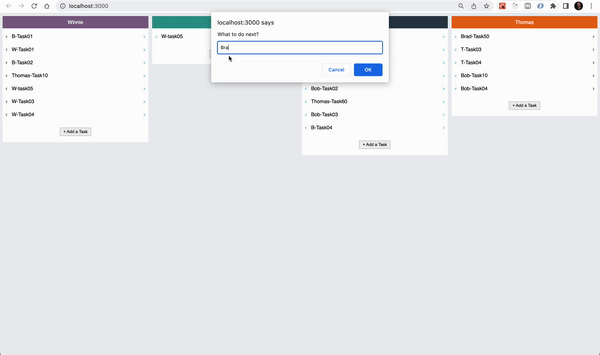

<div id="top"></div>

<br />
<div align="center">
  <h1 align="center">ToDo List to Move Tasks Between Users</h1>
  <br />
  <p align="center">
    
  </p>
  <br />
</div>

# Appointiments

A basic implementation of tasks to add and move tasks between users at the same postion where you are going to move that.

<br />


# Tools of Backend
* [NodeJS](https://nodejs.org/)
* [cors](https://www.npmjs.com/package/cors)
* [dotenv](https://www.npmjs.com/package/dotenv)
* [Express](https://expressjs.com/)
* [MongoDB](https://www.mongodb.com/)
* [nodemon](https://www.npmjs.com/package/nodemon)

<br />

# Tools of Frontend
* [React](https://reactjs.org/)
* [styled-components](https://styled-components.com/)
* [React Icons](https://react-icons.github.io/react-icons/)

<br />

# Instalation Backend
```
yarn install
```
```
1. create database in your mongodb server as todolist
2. create a users collection
3. import database.json in your users collection
4. set URI of your mongo database in .env file
5. import insomnia.json to your Insomnia project to see apis call
```
```
yarn dev
```

# Instalation Frontend
```
yarn install
```
```
yarn start
```

# License
MIT